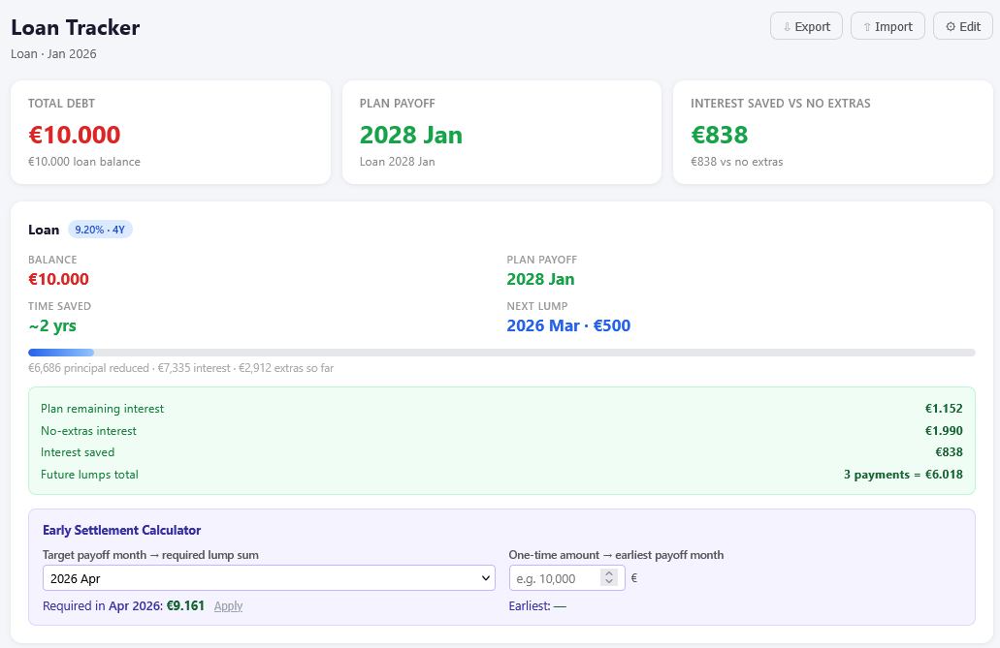
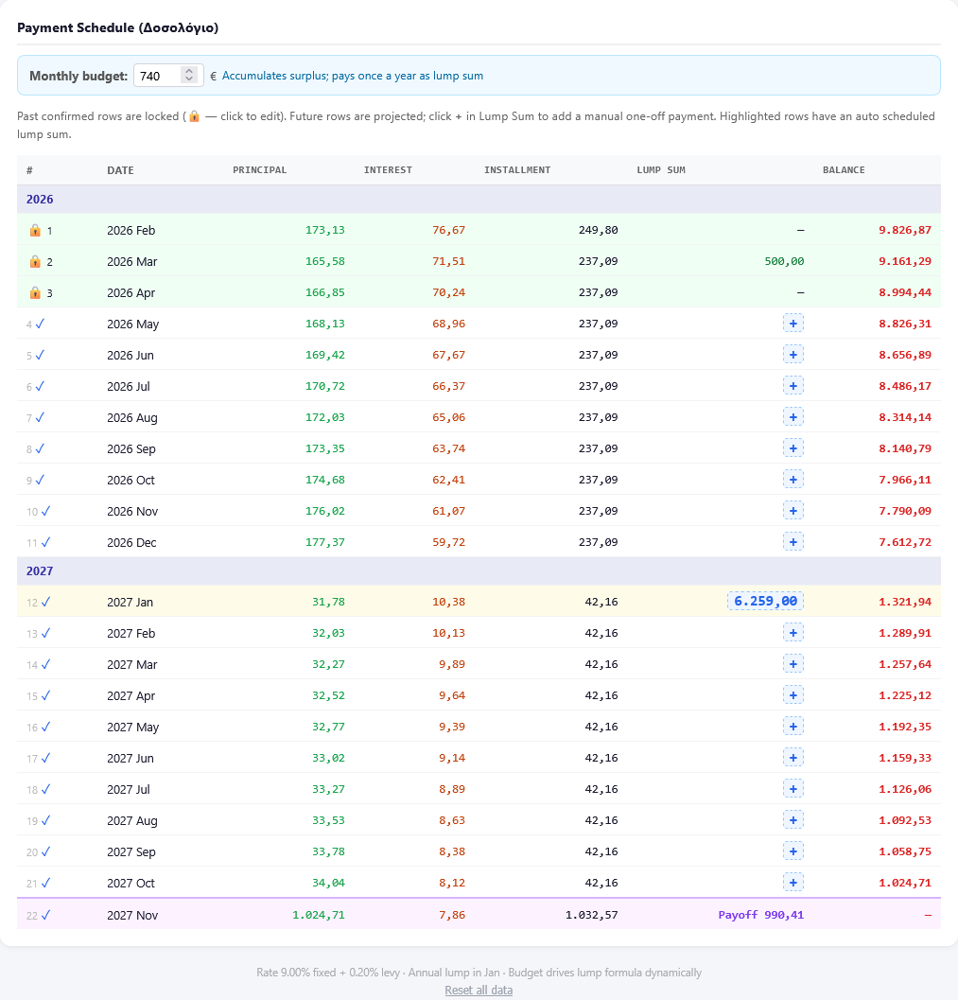
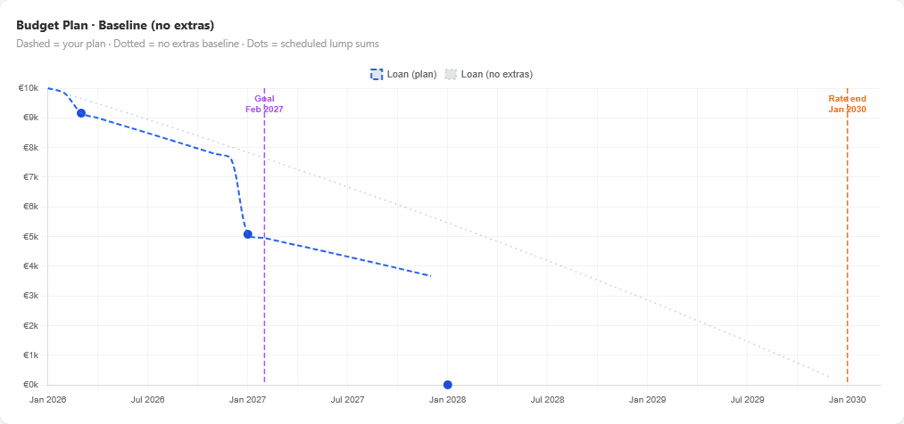
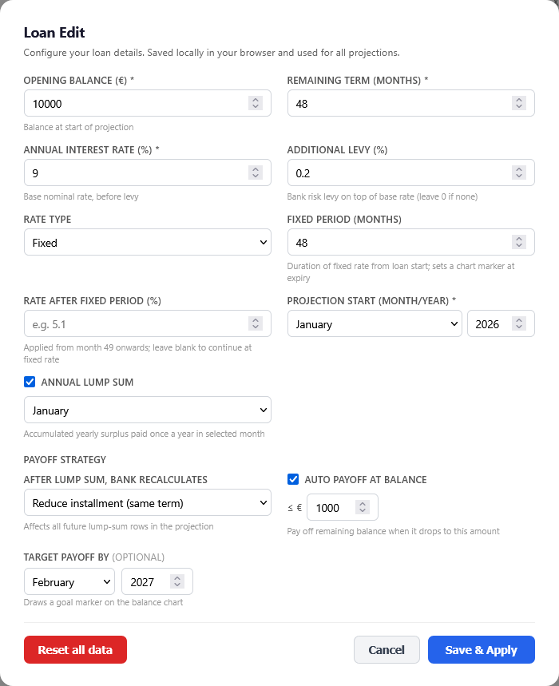

# Loan Tracker

A zero-install, browser-based loan tracker. Open the HTML file in any browser — no server, no setup, no dependencies.

**[Try it live](https://stel1os.github.io/loan-tracker/)**

## Screenshots

## What it does

- Configure each loan once (balance, term, rate, start date) — name it whatever you like
- Track multiple loans (e.g. mortgage + home repair): a Dashboard aggregates balance and payoff across all of them, each loan gets its own tab, and a shared monthly budget is split across loans with auto-redistributing sliders
- Set a monthly budget — see exactly when you'll be debt-free
- Schedule an annual lump-sum payment month; accumulated surplus pays against principal automatically
- Add one-off manual lump-sum payments to any future row
- Choose how the bank recalculates after each lump sum: **reduce duration** or **reduce installment**
- Plan a final balloon payoff: input a target month or a lump-sum amount, see the result instantly
- Confirm actual payments as they happen — locked rows are never overwritten by recalculations
- Export full app state to a JSON backup file; import it on any device to restore everything
- Balance trajectory chart with optional markers: fixed-rate end date and a user-set goal date
- Everything persists in your browser's `localStorage` — no account, no server, no data leaves your device

## How to use

1. Download `loan-tracker.html`
2. Open it in any browser
3. Enter your loan details on first run (or import a backup)
4. Set your monthly budget
5. Confirm payments as they happen

## Lump-sum modes

**Reduce duration** — installment stays roughly the same; the loan ends earlier with each extra payment.

**Reduce installment** — the term stays fixed; each extra payment lowers your monthly payment going forward.

## Backup and restore

Click **Export** in the header to download a timestamped JSON file of your full state (loan config, confirmed actuals, budget, lump-sum settings). Click **Import from backup** on the first-run screen to restore it — works on any browser or device.

## Files

| File | Description |
|---|---|
| `loan-tracker.html` | The entire app |
| `README.md` | This file |

## Development

This project is built using [Spec-Driven Development (SDD)](https://github.com/stel1os/ai-sdd-sop) — an AI-assisted software development methodology where every implementation task and test traces back to a numbered spec requirement.

## Support

If you find this useful, you can buy me a coffee:
[ko-fi.com/stel1os](https://ko-fi.com/stel1os)
